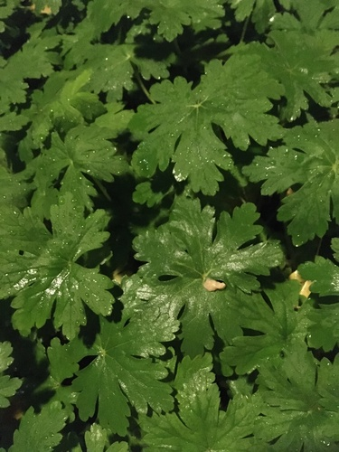
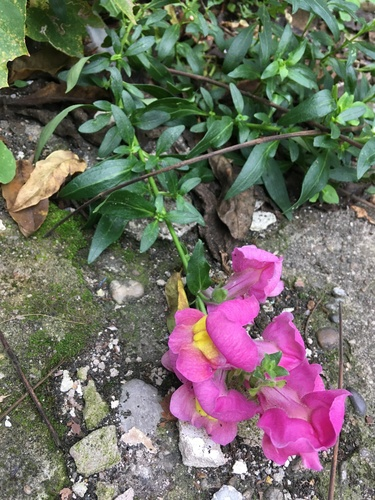
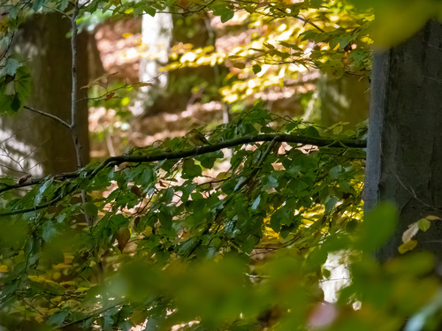
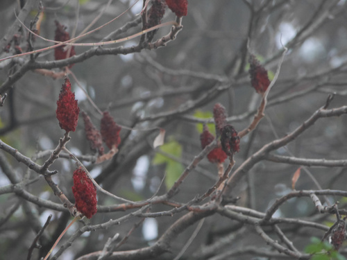
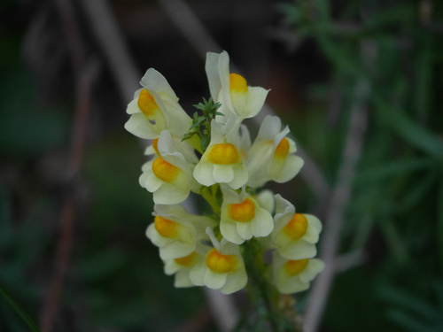
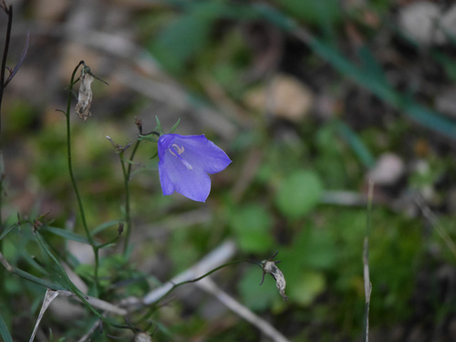
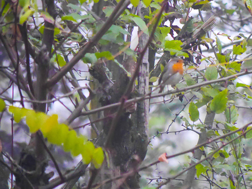
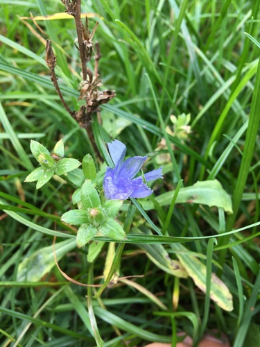
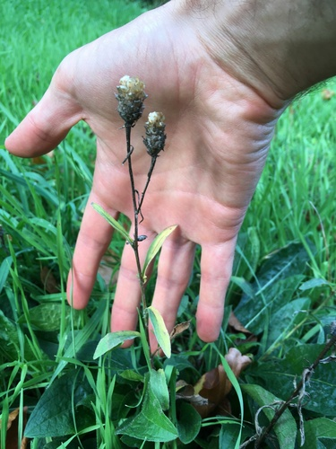
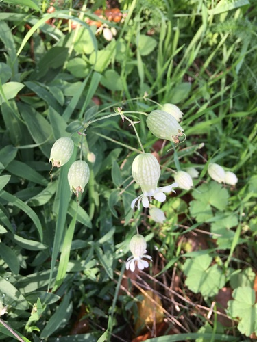

- ## iNat photos flashcards
	- {:height 200, :width 200}
	  by [[rhem42]] on 17/11/2022, 20:40 
	  [[Christuskirche]], [[Heidelberg]], [[Baden-Württemberg]], [[DE]]
	  [[iNat photos flashcards]] #card
		- {{embed [[Geranium macrorrhizum]]}}
	- {:height 200, :width 200}
	  by [[rhem42]] on 16/11/2022, 11:50 
	  [[Lessingstraße]], [[Heidelberg]], [[Baden-Württemberg]], [[DE]]
	  [[iNat photos flashcards]] #card
		- {{embed [[Antirrhinum majus]]}}
	- {:height 200, :width 200}
	  by [[rhem42]] on 13/11/2022, 20:54 
	  [[Bergstraße - Mitte]], [[Heidelberg]], [[Baden-Württemberg]], [[DE]]
	  [[iNat photos flashcards]] #card
	  collapsed:: true
		- {{embed [[Fringilla coelebs]]}}
	- {:height 200, :width 200}
	  by [[rhem42]] on 11/11/2022, 22:00 
	  [[Neckartal-Odenwald Nature Park]], [[Dossenheim]], [[Baden-Württemberg]], [[DE]]
	  [[iNat photos flashcards]] #card
	  collapsed:: true
		- {{embed [[Rhus typhina]]}}
	- {:height 200, :width 200}
	  by [[rhem42]] on 11/11/2022, 21:54 
	  [[Neckartal-Odenwald Nature Park]], [[Dossenheim]], [[Baden-Württemberg]], [[DE]]
	  [[iNat photos flashcards]] #card
	  collapsed:: true
		- {{embed [[Linaria vulgaris]]}}
	- {:height 200, :width 200}
	  by [[rhem42]] on 11/11/2022, 21:53 
	  [[Neckartal-Odenwald Nature Park]], [[Dossenheim]], [[Baden-Württemberg]], [[DE]]
	  [[iNat photos flashcards]] #card
	  collapsed:: true
		- {{embed [[Campanula rotundifolia]]}}
	- {:height 200, :width 200}
	  by [[rhem42]] on 11/11/2022, 21:52 
	  [[Neckartal-Odenwald Nature Park]], [[Dossenheim]], [[Baden-Württemberg]], [[DE]]
	  [[iNat photos flashcards]] #card
	  collapsed:: true
		- {{embed [[Erithacus rubecula]]}}
	- {:height 200, :width 200}
	  by [[rhem42]] on 01/11/2022, 14:36 
	  [[Neckar]], [[Heidelberg]], [[Baden-Württemberg]], [[DE]]
	  [[iNat photos flashcards]] #card
	  collapsed:: true
	  card-last-interval:: 4
	  card-repeats:: 1
	  card-ease-factor:: 2.6
	  card-next-schedule:: 2022-11-21T21:05:40.909Z
	  card-last-reviewed:: 2022-11-17T21:05:40.909Z
	  card-last-score:: 5
		- {{embed [[Cichorium intybus]]}}
	- {:height 200, :width 200}
	  by [[rhem42]] on 01/11/2022, 14:34 
	  [[Bergstraße - Mitte]], [[Heidelberg]], [[Baden-Württemberg]], [[DE]]
	  [[iNat photos flashcards]] #card
	  collapsed:: true
		- {{embed [[Centaurea jacea]]}}
	- {:height 200, :width 200}
	  by [[rhem42]] on 01/11/2022, 14:33 
	  [[Philosophengarten]], [[Heidelberg]], [[Baden-Württemberg]], [[DE]]
	  [[iNat photos flashcards]] #card
		- {{embed [[Silene vulgaris]]}}