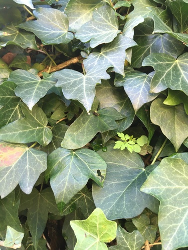
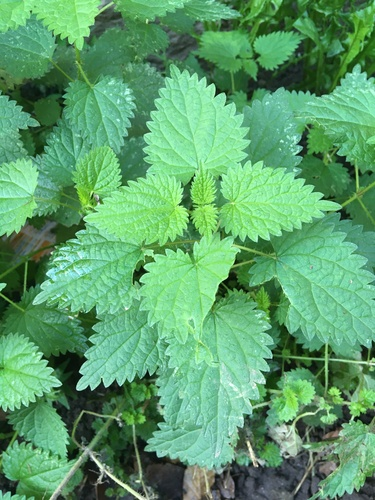
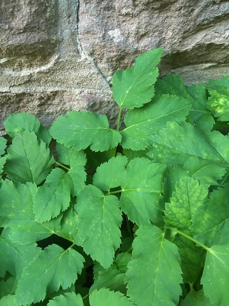

-
- ## iNat photos flashcards
  [[iNat-obs-photo]]
	- {:height 200, :width 200}
	  by [[rhem42]] on 01/11/2022, 14:04 
	  [[Naturpark Neckartal-Odenwald e.V.]], [[Heidelberg]], [[Baden-Württemberg]], [[DE]] #card
	  collapsed:: true
		- {{embed [[Hedera helix]]}}
	- {:height 200, :width 200}
	  by [[rhem42]] on 01/11/2022, 14:03 
	  [[Naturpark Neckartal-Odenwald e.V.]], [[Heidelberg]], [[Baden-Württemberg]], [[DE]] #card
	  collapsed:: true
	  card-last-interval:: -1
	  card-repeats:: 1
	  card-ease-factor:: 2.5
	  card-next-schedule:: 2022-11-17T23:00:00.000Z
	  card-last-reviewed:: 2022-11-17T18:21:57.774Z
	  card-last-score:: 1
		- {{embed [[Taxus baccata]]}}
	- {:height 200, :width 200}
	  by [[rhem42]] on 01/11/2022, 14:02 
	  [[Naturpark Neckartal-Odenwald e.V.]], [[Heidelberg]], [[Baden-Württemberg]], [[DE]] #card
	  collapsed:: true
		- {{embed [[Urtica dioica]]}}
	- {:height 200, :width 200}
	  by [[rhem42]] on 01/11/2022, 14:01 
	  [[Naturpark Neckartal-Odenwald e.V.]], [[Heidelberg]], [[Baden-Württemberg]], [[DE]] #card
	  collapsed:: true
		- {{embed [[Aegopodium podagraria]]}}