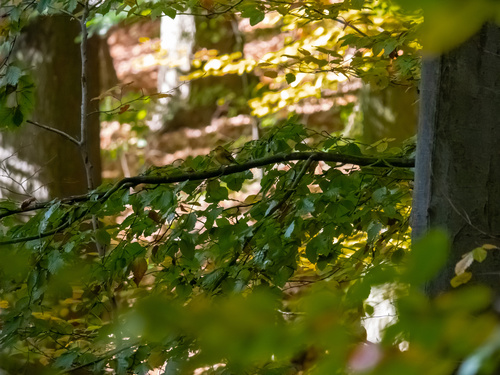
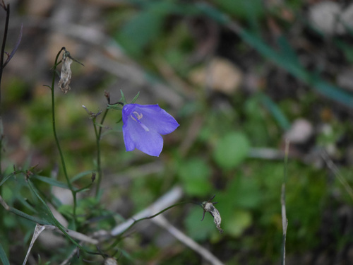

-

- ## iNat photos flashcards
  [[iNat photos flashcards]], [[tag1]], [[tag2]]
	- {:height 200, :width 200}
	 [Obs](https://www.inaturalist.org/observations/142236266) by [[rhem42]] on 17/11/2022, 20:40 
	  [[Christuskirche]], [[Heidelberg]], [[Baden-Württemberg]], [[DE]] #card
	  collapsed:: true
		- {{embed [[Plantae/Tracheophyta/Angiospermae/Magnoliopsida/Geraniales/Geraniaceae/Geranium/Robertium/Unguiculata/Geranium macrorrhizum]]}}
	- {:height 200, :width 200}
	 [Obs](https://www.inaturalist.org/observations/142236231) by [[rhem42]] on 17/11/2022, 20:40 
	  [[Christuskirche]], [[Heidelberg]], [[Baden-Württemberg]], [[DE]] #card
	  collapsed:: true
		- {{embed [[Plantae/Tracheophyta/Angiospermae/Magnoliopsida/Lamiales/Lamiaceae/Callicarpoideae/Callicarpa/Callicarpa americana]]}}
	- {:height 200, :width 200}
	 [Obs](https://www.inaturalist.org/observations/141918470) by [[rhem42]] on 13/11/2022, 20:54 
	  [[Bergstraße - Mitte]], [[Heidelberg]], [[Baden-Württemberg]], [[DE]] #card
	  collapsed:: true
		- {{embed [[Animalia/Chordata/Vertebrata/Aves/Passeriformes/Fringillidae/Fringilla/Fringilla coelebs]]}}
	- {:height 200, :width 200}
	 [Obs](https://www.inaturalist.org/observations/141724248) by [[rhem42]] on 11/11/2022, 22:00 
	  [[Neckartal-Odenwald Nature Park]], [[Dossenheim]], [[Baden-Württemberg]], [[DE]] #card
	  collapsed:: true
		- {{embed [[Plantae/Tracheophyta/Angiospermae/Magnoliopsida/Sapindales/Anacardiaceae/Anacardioideae/Rhus/Rhus typhina]]}}
	- {:height 200, :width 200}
	 [Obs](https://www.inaturalist.org/observations/141723966) by [[rhem42]] on 11/11/2022, 21:56 
	  [[Schulzengasse]], [[Heidelberg]], [[Baden-Württemberg]], [[DE]] #card
	  collapsed:: true
		- {{embed [[Plantae/Tracheophyta/Angiospermae/Magnoliopsida/Magnoliales/Magnoliaceae/Magnolia/Magnolia/Magnolia/Magnolia grandiflora]]}}
	- {:height 200, :width 200}
	 [Obs](https://www.inaturalist.org/observations/141723717) by [[rhem42]] on 11/11/2022, 21:54 
	  [[Neckartal-Odenwald Nature Park]], [[Dossenheim]], [[Baden-Württemberg]], [[DE]] #card
	  collapsed:: true
		- {{embed [[Plantae/Tracheophyta/Angiospermae/Magnoliopsida/Lamiales/Plantaginaceae/Antirrhineae/Linaria/Linaria vulgaris]]}}
	- {:height 200, :width 200}
	 [Obs](https://www.inaturalist.org/observations/141723694) by [[rhem42]] on 11/11/2022, 21:54 
	  [[Neckartal-Odenwald Nature Park]], [[Dossenheim]], [[Baden-Württemberg]], [[DE]] #card
	  collapsed:: true
		- {{embed [[Plantae/Tracheophyta/Angiospermae/Magnoliopsida/Asterales/Asteraceae/Asteroideae/Anthemideae/Leucantheminae/Leucanthemum/Leucanthemum vulgare/Leucanthemum vulgare]]}}
	- {:height 200, :width 200}
	 [Obs](https://www.inaturalist.org/observations/141723667) by [[rhem42]] on 11/11/2022, 21:53 
	  [[Neckartal-Odenwald Nature Park]], [[Dossenheim]], [[Baden-Württemberg]], [[DE]] #card
	  collapsed:: true
		- {{embed [[Fungi/Basidiomycota/Agaricomycotina/Agaricomycetes/Agaricomycetidae/Agaricales/Agaricineae/Psathyrellaceae/Parasola/Parasola/Parasola plicatilis]]}}
	- {:height 200, :width 200}
	 [Obs](https://www.inaturalist.org/observations/141723626) by [[rhem42]] on 11/11/2022, 21:53 
	  [[Neckartal-Odenwald Nature Park]], [[Dossenheim]], [[Baden-Württemberg]], [[DE]] #card
	  collapsed:: true
		- {{embed [[Plantae/Tracheophyta/Angiospermae/Magnoliopsida/Asterales/Campanulaceae/Campanuloideae/Campanula/Campanula rotundifolia/Campanula rotundifolia]]}}
	- {:height 200, :width 200}
	 [Obs](https://www.inaturalist.org/observations/141723546) by [[rhem42]] on 11/11/2022, 21:52 
	  [[Neckartal-Odenwald Nature Park]], [[Dossenheim]], [[Baden-Württemberg]], [[DE]] #card
	  collapsed:: true
		- {{embed [[Animalia/Chordata/Vertebrata/Aves/Passeriformes/Muscicapidae/Erithacus/Erithacus rubecula]]}}