- ## iNat sounds flashcards
  [[iNat sounds flashcards]]
	- {:height 200, :width 200}
	  [Observation](https://www.inaturalist.org/observations/139749931) by [[schindiilisa]] on 23/10/2022, 16:33 
	  [[Kurfürsten-Anlage]], [[Heidelberg]], [[Baden-Württemberg]], [[DE]] #card
	  collapsed:: true
	  card-last-interval:: 4
	  card-repeats:: 1
	  card-ease-factor:: 2.36
	  card-next-schedule:: 2022-11-24T12:03:25.969Z
	  card-last-reviewed:: 2022-11-20T12:03:25.969Z
	  card-last-score:: 3
		- {{embed [[Animalia/Chordata/Vertebrata/Aves/Psittaciformes/Psittaculidae/Psittacula/Psittacula krameri]]}}
	- {:height 200, :width 200}
	  [Observation](https://www.inaturalist.org/observations/135297401) by [[thephoxinus]] on 16/09/2022, 23:17 
	  [[69117 Heidelberg]], [[Germany]] #card
	  collapsed:: true
	  card-last-interval:: 4
	  card-repeats:: 1
	  card-ease-factor:: 2.36
	  card-next-schedule:: 2022-11-24T12:03:54.477Z
	  card-last-reviewed:: 2022-11-20T12:03:54.478Z
	  card-last-score:: 3
		- {{embed [[Animalia/Chordata/Vertebrata/Aves/Strigiformes/Strigidae/Strix/Strix aluco]]}}
	- {:height 200, :width 200}
	  [Observation](https://www.inaturalist.org/observations/112267448) by [[s_kai]] on 21/04/2022, 16:18 
	  [[Handschuhsheim]], [[Heidelberg]], [[Deutschland]] #card
	  collapsed:: true
	  card-last-interval:: -1
	  card-repeats:: 1
	  card-ease-factor:: 2.5
	  card-next-schedule:: 2022-11-20T23:00:00.000Z
	  card-last-reviewed:: 2022-11-20T12:05:37.853Z
	  card-last-score:: 1
		- {{embed [[Animalia/Chordata/Vertebrata/Aves/Passeriformes/Fringillidae/Coccothraustes/Coccothraustes coccothraustes]]}}
	- {:height 200, :width 200}
	  [Observation](https://www.inaturalist.org/observations/86444941) by [[inasiebert]] on 10/07/2021, 20:37 
	  [[Neuenheim]], [[Heidelberg]], [[Deutschland]] #card
	  collapsed:: true
	  card-last-interval:: -1
	  card-repeats:: 1
	  card-ease-factor:: 2.5
	  card-next-schedule:: 2022-11-20T23:00:00.000Z
	  card-last-reviewed:: 2022-11-20T12:02:35.813Z
	  card-last-score:: 1
		- {{embed [[Animalia/Chordata/Vertebrata/Aves/Passeriformes/Acrocephalidae/Acrocephalus/Acrocephalus scirpaceus]]}}
	- {:height 200, :width 200}
	  [Observation](https://www.inaturalist.org/observations/82525985) by [[jakob2006]] on 11/06/2021, 11:51 
	  [[Geo-Naturpark Bergstraße-Odenwald]], [[Heidelberg]], [[Baden-Württemberg]], [[DE]] #card
	  collapsed:: true
	  card-last-interval:: -1
	  card-repeats:: 1
	  card-ease-factor:: 2.5
	  card-next-schedule:: 2022-11-20T23:00:00.000Z
	  card-last-reviewed:: 2022-11-20T12:03:34.004Z
	  card-last-score:: 1
		- {{embed [[Animalia/Chordata/Vertebrata/Aves/Passeriformes/Sylviidae/Sylvia/Sylvia atricapilla]]}}
	- {:height 200, :width 200}
	  [Observation](https://www.inaturalist.org/observations/81540618) by [[cosmos-o]] on 04/06/2021, 11:39 
	  [[ドイツ ハイデルベルク ノイエンハイム]] #card
	  collapsed:: true
	  card-last-interval:: -1
	  card-repeats:: 1
	  card-ease-factor:: 2.5
	  card-next-schedule:: 2022-11-20T23:00:00.000Z
	  card-last-reviewed:: 2022-11-20T11:58:55.176Z
	  card-last-score:: 1
		- {{embed [[Animalia/Chordata/Vertebrata/Aves/Passeriformes/Acrocephalidae/Acrocephalus/Acrocephalus scirpaceus]]}}
	- {:height 200, :width 200}
	  [Observation](https://www.inaturalist.org/observations/78867210) by [[iosonogerda]] on 16/05/2021, 01:12 
	  [[Heidelberg]], [[Germania]] #card
	  collapsed:: true
	  card-last-interval:: -1
	  card-repeats:: 1
	  card-ease-factor:: 2.5
	  card-next-schedule:: 2022-11-20T23:00:00.000Z
	  card-last-reviewed:: 2022-11-20T11:56:51.970Z
	  card-last-score:: 1
		- {{embed [[Animalia/Chordata/Vertebrata/Aves/Passeriformes/Turdidae/Turdus/Turdus philomelos]]}}
	- {:height 200, :width 200}
	  [Observation](https://www.inaturalist.org/observations/70106396) by [[iosonogerda]] on 25/02/2021, 03:33 
	  [[Ziegelhausen]], [[69118 Heidelberg]], [[Germania]] #card
	  collapsed:: true
	  card-last-interval:: -1
	  card-repeats:: 1
	  card-ease-factor:: 2.5
	  card-next-schedule:: 2022-11-20T23:00:00.000Z
	  card-last-reviewed:: 2022-11-20T11:58:06.422Z
	  card-last-score:: 1
		- {{embed [[Animalia/Chordata/Vertebrata/Aves/Passeriformes/Aegithalidae/Aegithalos/Aegithalos caudatus]]}}
	- {:height 200, :width 200}
	  [Observation](https://www.inaturalist.org/observations/69993958) by [[iosonogerda]] on 23/02/2021, 00:24 
	  [[Ziegelhausen]], [[69118 Heidelberg]], [[Germania]] #card
	  collapsed:: true
	  card-last-interval:: -1
	  card-repeats:: 1
	  card-ease-factor:: 2.5
	  card-next-schedule:: 2022-11-20T23:00:00.000Z
	  card-last-reviewed:: 2022-11-20T12:06:51.440Z
	  card-last-score:: 1
		- {{embed [[Animalia/Chordata/Vertebrata/Aves/Passeriformes/Fringillidae/Pyrrhula/Pyrrhula pyrrhula]]}}
	- {:height 200, :width 200}
	  [Observation](https://www.inaturalist.org/observations/69869979) by [[iosonogerda]] on 21/02/2021, 00:41 
	  [[Neuenheim]], [[Heidelberg]], [[Germania]] #card
	  collapsed:: true
	  card-last-interval:: -1
	  card-repeats:: 1
	  card-ease-factor:: 2.5
	  card-next-schedule:: 2022-11-20T23:00:00.000Z
	  card-last-reviewed:: 2022-11-20T12:02:53.062Z
	  card-last-score:: 1
		- {{embed [[Animalia/Chordata/Vertebrata/Aves/Passeriformes/Fringillidae/Carduelis/Carduelis carduelis]]}}

- ## iNat photos flashcards
  [[iNat photos flashcards]]
  collapsed:: true
	- {:height 200, :width 200}
	  [Observation](https://www.inaturalist.org/observations/142236266) by [[rhem42]] on 17/11/2022, 20:40 
	  [[Christuskirche]], [[Heidelberg]], [[Baden-Württemberg]], [[DE]] #card
	  collapsed:: true
		- {{embed [[Plantae/Tracheophyta/Angiospermae/Magnoliopsida/Geraniales/Geraniaceae/Geranium/Robertium/Unguiculata/Geranium macrorrhizum]]}}
	- {:height 200, :width 200}
	  [Observation](https://www.inaturalist.org/observations/141918470) by [[rhem42]] on 13/11/2022, 20:54 
	  [[Bergstraße - Mitte]], [[Heidelberg]], [[Baden-Württemberg]], [[DE]] #card
	  collapsed:: true
		- {{embed [[Animalia/Chordata/Vertebrata/Aves/Passeriformes/Fringillidae/Fringilla/Fringilla coelebs]]}}
	- 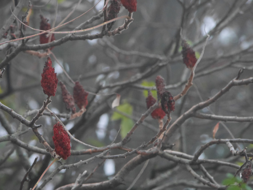{:height 200, :width 200}
	  [Observation](https://www.inaturalist.org/observations/141724248) by [[rhem42]] on 11/11/2022, 22:00 
	  [[Neckartal-Odenwald Nature Park]], [[Dossenheim]], [[Baden-Württemberg]], [[DE]] #card
	  collapsed:: true
		- {{embed [[Plantae/Tracheophyta/Angiospermae/Magnoliopsida/Sapindales/Anacardiaceae/Anacardioideae/Rhus/Rhus typhina]]}}
	- 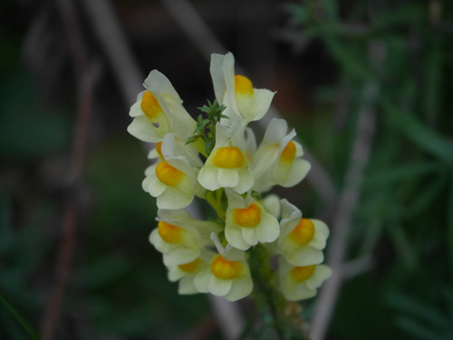{:height 200, :width 200}
	  [Observation](https://www.inaturalist.org/observations/141723717) by [[rhem42]] on 11/11/2022, 21:54 
	  [[Neckartal-Odenwald Nature Park]], [[Dossenheim]], [[Baden-Württemberg]], [[DE]] #card
	  collapsed:: true
		- {{embed [[Plantae/Tracheophyta/Angiospermae/Magnoliopsida/Lamiales/Plantaginaceae/Antirrhineae/Linaria/Linaria vulgaris]]}}
	- {:height 200, :width 200}
	  [Observation](https://www.inaturalist.org/observations/141723626) by [[rhem42]] on 11/11/2022, 21:53 
	  [[Neckartal-Odenwald Nature Park]], [[Dossenheim]], [[Baden-Württemberg]], [[DE]] #card
	  collapsed:: true
		- {{embed [[Plantae/Tracheophyta/Angiospermae/Magnoliopsida/Asterales/Campanulaceae/Campanuloideae/Campanula/Campanula rotundifolia/Campanula rotundifolia]]}}
	- 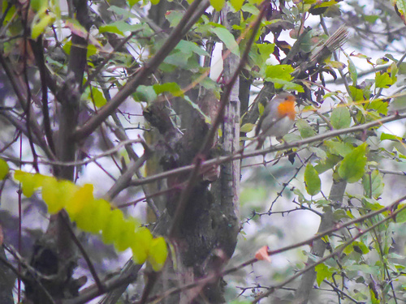{:height 200, :width 200}
	  [Observation](https://www.inaturalist.org/observations/141723546) by [[rhem42]] on 11/11/2022, 21:52 
	  [[Neckartal-Odenwald Nature Park]], [[Dossenheim]], [[Baden-Württemberg]], [[DE]] #card
	  collapsed:: true
		- {{embed [[Animalia/Chordata/Vertebrata/Aves/Passeriformes/Muscicapidae/Erithacus/Erithacus rubecula]]}}
	- 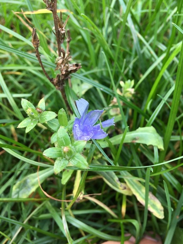{:height 200, :width 200}
	  [Observation](https://www.inaturalist.org/observations/140773309) by [[rhem42]] on 01/11/2022, 14:36 
	  [[Neckar]], [[Heidelberg]], [[Baden-Württemberg]], [[DE]] #card
	  collapsed:: true
		- {{embed [[Plantae/Tracheophyta/Angiospermae/Magnoliopsida/Asterales/Asteraceae/Cichorioideae/Cichorieae/Cichoriinae/Cichorium/Cichorium intybus]]}}
	- 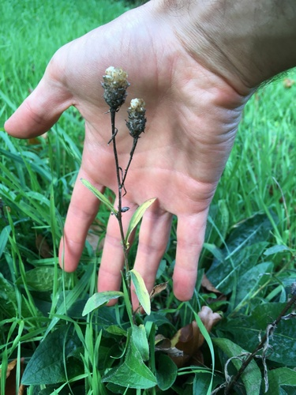{:height 200, :width 200}
	  [Observation](https://www.inaturalist.org/observations/140773069) by [[rhem42]] on 01/11/2022, 14:34 
	  [[Bergstraße - Mitte]], [[Heidelberg]], [[Baden-Württemberg]], [[DE]] #card
	  collapsed:: true
		- {{embed [[Plantae/Tracheophyta/Angiospermae/Magnoliopsida/Asterales/Asteraceae/Carduoideae/Cardueae/Centaureinae/Centaurea/Centaurea/Phrygia/Centaurea jacea]]}}
	- 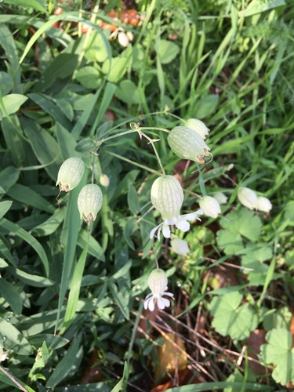{:height 200, :width 200}
	  [Observation](https://www.inaturalist.org/observations/140772916) by [[rhem42]] on 01/11/2022, 14:33 
	  [[Philosophengarten]], [[Heidelberg]], [[Baden-Württemberg]], [[DE]] #card
	  collapsed:: true
		- {{embed [[Plantae/Tracheophyta/Angiospermae/Magnoliopsida/Caryophyllales/Caryophyllaceae/Caryophylloideae/Sileneae/Silene/Behenantha/Behenantha/Silene vulgaris]]}}
	- {:height 200, :width 200}
	  [Observation](https://www.inaturalist.org/observations/140772091) by [[rhem42]] on 01/11/2022, 14:24 
	  [[Naturpark Neckartal-Odenwald e.V.]], [[Heidelberg]], [[Baden-Württemberg]], [[DE]] #card
	  collapsed:: true
		- {{embed [[Plantae/Tracheophyta/Angiospermae/Magnoliopsida/Gentianales/Apocynaceae/Rauvolfioideae/Vinceae/Vincinae/Vinca/Vinca major]]}}
	- {:height 200, :width 200}
	  [Observation](https://www.inaturalist.org/observations/140771821) by [[rhem42]] on 01/11/2022, 14:22 
	  [[Hannah-Arendt-Straße]], [[Heidelberg]], [[Baden-Württemberg]], [[DE]] #card
	  collapsed:: true
		- {{embed [[Plantae/Tracheophyta/Angiospermae/Magnoliopsida/Geraniales/Geraniaceae/Geranium/Robertium/Ruberta/Geranium robertianum]]}}
	- {:height 200, :width 200}
	  [Observation](https://www.inaturalist.org/observations/140770840) by [[rhem42]] on 01/11/2022, 14:11 
	  [[Bergstraße - Mitte]], [[Heidelberg]], [[Baden-Württemberg]], [[DE]] #card
	  collapsed:: true
		- {{embed [[Plantae/Tracheophyta/Angiospermae/Magnoliopsida/Rosales/Rosaceae/Rosoideae/Potentilleae/Fragariinae/Fragaria/Fragaria vesca]]}}
	- {:height 200, :width 200}
	  [Observation](https://www.inaturalist.org/observations/140770623) by [[rhem42]] on 01/11/2022, 14:08 
	  [[Naturpark Neckartal-Odenwald e.V.]], [[Heidelberg]], [[Baden-Württemberg]], [[DE]] #card
	  collapsed:: true
		- {{embed [[Plantae/Tracheophyta/Angiospermae/Magnoliopsida/Cornales/Cornaceae/Cornus/Kraniopsis/Cornus sanguinea]]}}
	- {:height 200, :width 200}
	  [Observation](https://www.inaturalist.org/observations/140770516) by [[rhem42]] on 01/11/2022, 14:07 
	  [[Naturpark Neckartal-Odenwald e.V.]], [[Heidelberg]], [[Baden-Württemberg]], [[DE]] #card
	  collapsed:: true
		- {{embed [[Plantae/Tracheophyta/Angiospermae/Magnoliopsida/Ranunculales/Papaveraceae/Papaveroideae/Chelidonium/Chelidonium majus]]}}
	- {:height 200, :width 200}
	  [Observation](https://www.inaturalist.org/observations/140770309) by [[rhem42]] on 01/11/2022, 14:04 
	  [[Naturpark Neckartal-Odenwald e.V.]], [[Heidelberg]], [[Baden-Württemberg]], [[DE]] #card
	  collapsed:: true
		- {{embed [[Plantae/Tracheophyta/Angiospermae/Magnoliopsida/Apiales/Araliaceae/Hedera/Hedera helix]]}}
	- 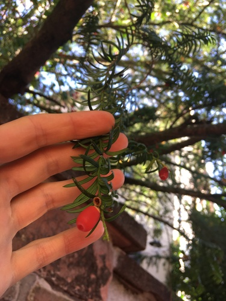{:height 200, :width 200}
	  [Observation](https://www.inaturalist.org/observations/140770222) by [[rhem42]] on 01/11/2022, 14:03 
	  [[Naturpark Neckartal-Odenwald e.V.]], [[Heidelberg]], [[Baden-Württemberg]], [[DE]] #card
	  collapsed:: true
		- {{embed [[Plantae/Tracheophyta/Pinopsida/Pinales/Taxaceae/Taxus/Taxus baccata]]}}
	- 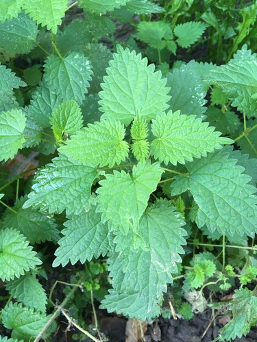{:height 200, :width 200}
	  [Observation](https://www.inaturalist.org/observations/140770138) by [[rhem42]] on 01/11/2022, 14:02 
	  [[Naturpark Neckartal-Odenwald e.V.]], [[Heidelberg]], [[Baden-Württemberg]], [[DE]] #card
	  collapsed:: true
		- {{embed [[Plantae/Tracheophyta/Angiospermae/Magnoliopsida/Rosales/Urticaceae/Urtica/Urtica dioica]]}}
	- 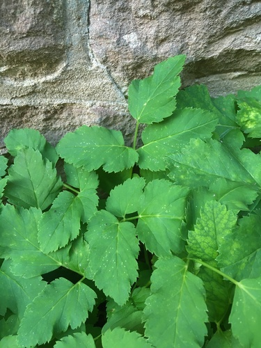{:height 200, :width 200}
	  [Observation](https://www.inaturalist.org/observations/140770101) by [[rhem42]] on 01/11/2022, 14:01 
	  [[Naturpark Neckartal-Odenwald e.V.]], [[Heidelberg]], [[Baden-Württemberg]], [[DE]] #card
	  collapsed:: true
		- {{embed [[Plantae/Tracheophyta/Angiospermae/Magnoliopsida/Apiales/Apiaceae/Apioideae/Careae/Aegopodium/Aegopodium podagraria]]}}
	- {:height 200, :width 200}
	  [Observation](https://www.inaturalist.org/observations/140770032) by [[rhem42]] on 01/11/2022, 14:01 
	  [[Naturpark Neckartal-Odenwald e.V.]], [[Heidelberg]], [[Baden-Württemberg]], [[DE]] #card
	  collapsed:: true
		- {{embed [[Plantae/Tracheophyta/Angiospermae/Magnoliopsida/Ranunculales/Papaveraceae/Fumarioideae/Pseudofumaria/Pseudofumaria lutea]]}}
	- 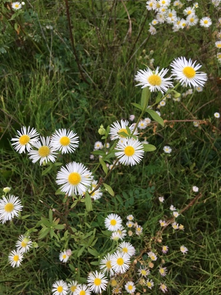{:height 200, :width 200}
	  [Observation](https://www.inaturalist.org/observations/140770000) by [[rhem42]] on 01/11/2022, 14:00 
	  [[Rudolf-Diesel-Straße]], [[Heidelberg]], [[Baden-Württemberg]], [[DE]] #card
	  collapsed:: true
		- {{embed [[Plantae/Tracheophyta/Angiospermae/Magnoliopsida/Asterales/Asteraceae/Asteroideae/Astereae/Conyzinae/Erigeron/Phalacroloma/Erigeron annuus]]}}
	- {:height 200, :width 200}
	  [Observation](https://www.inaturalist.org/observations/139874087) by [[rhem42]] on 24/10/2022, 17:18 
	  [[Forêt Départementale de Marseilleveyre]], [[Marsiglia]], [[Provenza-Alpi-Costa Azzurra]], [[FR]] #card
	  collapsed:: true
		- {{embed [[Plantae/Tracheophyta/Angiospermae/Magnoliopsida/Rosales/Rhamnaceae/Rhamneae/Rhamnus/Rhamnus alaternus]]}}
	- {:height 200, :width 200}
	  [Observation](https://www.inaturalist.org/observations/139874068) by [[rhem42]] on 24/10/2022, 17:18 
	  [[Forêt Départementale de Marseilleveyre]], [[Marsiglia]], [[Provenza-Alpi-Costa Azzurra]], [[FR]] #card
	  collapsed:: true
		- {{embed [[Animalia/Arthropoda/Hexapoda/Insecta/Pterygota/Orthoptera/Caelifera/Acrididea/Acridoidea/Acrididae/Oedipodinae/Locustini/Locustina/Locusta/Locusta migratoria]]}}
	- {:height 200, :width 200}
	  [Observation](https://www.inaturalist.org/observations/138110321) by [[rhem42]] on 09/10/2022, 15:17 
	  [[Parc Borely]], [[Marsiglia]], [[Provenza-Alpi-Costa Azzurra]], [[FR]] #card
	  collapsed:: true
		- {{embed [[Animalia/Chordata/Vertebrata/Aves/Charadriiformes/Laridae/Larinae/Larus/Larus michahellis]]}}
	- {:height 200, :width 200}
	  [Observation](https://www.inaturalist.org/observations/137433411) by [[rhem42]] on 03/10/2022, 19:20 
	  [[Forêt Départementale de Marseilleveyre]], [[Marsiglia]], [[Provenza-Alpi-Costa Azzurra]], [[FR]] #card
	  collapsed:: true
		- {{embed [[Plantae/Tracheophyta/Angiospermae/Magnoliopsida/Brassicales/Brassicaceae/Anastaticeae/Lobularia/Lobularia maritima]]}}
	- {:height 200, :width 200}
	  [Observation](https://www.inaturalist.org/observations/137433342) by [[rhem42]] on 03/10/2022, 19:19 
	  [[Forêt Départementale de Marseilleveyre]], [[Marsiglia]], [[Provenza-Alpi-Costa Azzurra]], [[FR]] #card
	  collapsed:: true
		- {{embed [[Plantae/Tracheophyta/Angiospermae/Magnoliopsida/Dipsacales/Caprifoliaceae/Valerianoideae/Centranthus/Centranthus ruber]]}}
	- {:height 200, :width 200}
	  [Observation](https://www.inaturalist.org/observations/137031952) by [[rhem42]] on 30/09/2022, 17:18 
	  [[Naturpark Neckartal-Odenwald e.V.]], [[Heidelberg]], [[Baden-Württemberg]], [[DE]] #card
	  collapsed:: true
		- {{embed [[Plantae/Tracheophyta/Angiospermae/Magnoliopsida/Caryophyllales/Portulacaceae/Portulaca/Portulaca oleracea]]}}
	- 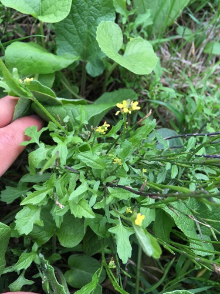{:height 200, :width 200}
	  [Observation](https://www.inaturalist.org/observations/136417798) by [[rhem42]] on 25/09/2022, 14:52 
	  [[Neckar]], [[Heidelberg]], [[Baden-Württemberg]], [[DE]] #card
	  collapsed:: true
		- {{embed [[Plantae/Tracheophyta/Angiospermae/Magnoliopsida/Brassicales/Brassicaceae/Sisymbrieae/Sisymbrium/Sisymbrium officinale]]}}
	- {:height 200, :width 200}
	  [Observation](https://www.inaturalist.org/observations/136417620) by [[rhem42]] on 25/09/2022, 14:50 
	  [[Neckarwiese]], [[Heidelberg]], [[Baden-Württemberg]], [[DE]] #card
	  collapsed:: true
		- {{embed [[Plantae/Tracheophyta/Angiospermae/Magnoliopsida/Lamiales/Lamiaceae/Lamioideae/Marrubieae/Ballota/Ballota nigra]]}}
	- {:height 200, :width 200}
	  [Observation](https://www.inaturalist.org/observations/136417264) by [[rhem42]] on 25/09/2022, 14:46 
	  [[Neckarwiese]], [[Heidelberg]], [[Baden-Württemberg]], [[DE]] #card
	  collapsed:: true
		- {{embed [[Plantae/Tracheophyta/Angiospermae/Magnoliopsida/Fagales/Juglandaceae/Juglans/Juglans regia]]}}
	- {:height 200, :width 200}
	  [Observation](https://www.inaturalist.org/observations/136417148) by [[rhem42]] on 25/09/2022, 14:45 
	  [[Neckar]], [[Heidelberg]], [[Baden-Württemberg]], [[DE]] #card
	  collapsed:: true
		- {{embed [[Plantae/Tracheophyta/Angiospermae/Magnoliopsida/Asterales/Asteraceae/Asteroideae/Anthemideae/Artemisiinae/Artemisia/Artemisia vulgaris]]}}
	- 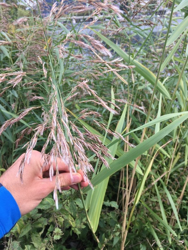{:height 200, :width 200}
	  [Observation](https://www.inaturalist.org/observations/136416886) by [[rhem42]] on 25/09/2022, 14:42 
	  [[Neckarwiese]], [[Heidelberg]], [[Baden-Württemberg]], [[DE]] #card
	  collapsed:: true
		- {{embed [[Plantae/Tracheophyta/Angiospermae/Liliopsida/Poales/Poaceae/Arundinoideae/Molinieae/Phragmites/Phragmites australis]]}}
	- {:height 200, :width 200}
	  [Observation](https://www.inaturalist.org/observations/136416793) by [[rhem42]] on 25/09/2022, 14:41 
	  [[Neckar]], [[Heidelberg]], [[Baden-Württemberg]], [[DE]] #card
	  collapsed:: true
		- {{embed [[Plantae/Tracheophyta/Angiospermae/Magnoliopsida/Asterales/Asteraceae/Asteroideae/Astereae/Solidagininae/Solidago/Solidago/Triplinerviae/Solidago canadensis]]}}
	- {:height 200, :width 200}
	  [Observation](https://www.inaturalist.org/observations/136416195) by [[rhem42]] on 25/09/2022, 14:35 
	  [[Neckarwiese]], [[Heidelberg]], [[Baden-Württemberg]], [[DE]] #card
	  collapsed:: true
		- {{embed [[Plantae/Tracheophyta/Angiospermae/Magnoliopsida/Asterales/Asteraceae/Asteroideae/Heliantheae/Helianthinae/Helianthus/Helianthus annuus]]}}
	- {:height 200, :width 200}
	  [Observation](https://www.inaturalist.org/observations/136416109) by [[rhem42]] on 25/09/2022, 14:34 
	  [[Neckarwiese]], [[Heidelberg]], [[Baden-Württemberg]], [[DE]] #card
	  collapsed:: true
		- {{embed [[Plantae/Tracheophyta/Angiospermae/Magnoliopsida/Asterales/Asteraceae/Asteroideae/Heliantheae/Ambrosiinae/Ambrosia/Ambrosia artemisiifolia]]}}
	- {:height 200, :width 200}
	  [Observation](https://www.inaturalist.org/observations/136415983) by [[rhem42]] on 25/09/2022, 14:33 
	  [[Neckar]], [[Heidelberg]], [[Baden-Württemberg]], [[DE]] #card
	  collapsed:: true
		- {{embed [[Plantae/Tracheophyta/Angiospermae/Magnoliopsida/Caryophyllales/Polygonaceae/Polygonoideae/Rumiceae/Rumex/Rumex hydrolapathum]]}}
	- {:height 200, :width 200}
	  [Observation](https://www.inaturalist.org/observations/136415867) by [[rhem42]] on 25/09/2022, 14:31 
	  [[Neckar]], [[Heidelberg]], [[Baden-Württemberg]], [[DE]] #card
	  collapsed:: true
		- {{embed [[Plantae/Tracheophyta/Angiospermae/Magnoliopsida/Asterales/Asteraceae/Asteroideae/Inuleae/Inulinae/Pulicaria/Pulicaria dysenterica]]}}
	- {:height 200, :width 200}
	  [Observation](https://www.inaturalist.org/observations/136415734) by [[rhem42]] on 25/09/2022, 14:30 
	  [[Neckarwiese]], [[Heidelberg]], [[Baden-Württemberg]], [[DE]] #card
	  collapsed:: true
		- {{embed [[Plantae/Tracheophyta/Angiospermae/Magnoliopsida/Lamiales/Lamiaceae/Scutellarioideae/Scutellaria/Scutellaria galericulata]]}}
	- {:height 200, :width 200}
	  [Observation](https://www.inaturalist.org/observations/136415643) by [[rhem42]] on 25/09/2022, 14:29 
	  [[Neckarwiese]], [[Heidelberg]], [[Baden-Württemberg]], [[DE]] #card
	  collapsed:: true
		- {{embed [[Plantae/Tracheophyta/Angiospermae/Magnoliopsida/Fagales/Betulaceae/Alnus/Alnus glutinosa]]}}
	- {:height 200, :width 200}
	  [Observation](https://www.inaturalist.org/observations/136415333) by [[rhem42]] on 25/09/2022, 14:25 
	  [[Neckarwiese]], [[Heidelberg]], [[Baden-Württemberg]], [[DE]] #card
	  collapsed:: true
		- {{embed [[Plantae/Tracheophyta/Angiospermae/Magnoliopsida/Asterales/Asteraceae/Asteroideae/Eupatorieae/Eupatoriinae/Eupatorium/Eupatorium cannabinum]]}}
	- {:height 200, :width 200}
	  [Observation](https://www.inaturalist.org/observations/136415252) by [[rhem42]] on 25/09/2022, 14:24 
	  [[Neckarwiese]], [[Heidelberg]], [[Baden-Württemberg]], [[DE]] #card
	  collapsed:: true
		- {{embed [[Plantae/Tracheophyta/Angiospermae/Magnoliopsida/Asterales/Asteraceae/Asteroideae/Astereae/Solidagininae/Solidago/Solidago/Triplinerviae/Solidago canadensis]]}}
	- {:height 200, :width 200}
	  [Observation](https://www.inaturalist.org/observations/136415182) by [[rhem42]] on 25/09/2022, 14:23 
	  [[Neckar]], [[Heidelberg]], [[Baden-Württemberg]], [[DE]] #card
	  collapsed:: true
		- {{embed [[Plantae/Tracheophyta/Angiospermae/Magnoliopsida/Lamiales/Verbenaceae/Verbeneae/Verbena/Verbena officinalis]]}}
	- {:height 200, :width 200}
	  [Observation](https://www.inaturalist.org/observations/136414099) by [[rhem42]] on 25/09/2022, 14:12 
	  [[Neckarwiese]], [[Heidelberg]], [[Baden-Württemberg]], [[DE]] #card
	  collapsed:: true
		- {{embed [[Animalia/Arthropoda/Hexapoda/Insecta/Pterygota/Coleoptera/Polyphaga/Cucujiformia/Chrysomeloidea/Chrysomelidae/Chrysomelinae/Doryphorini/Chrysolinina/Chrysolina/Synerga/Chrysolina coerulans]]}}
	- {:height 200, :width 200}
	  [Observation](https://www.inaturalist.org/observations/136413910) by [[rhem42]] on 25/09/2022, 14:10 
	  [[Neckarwiese]], [[Heidelberg]], [[Baden-Württemberg]], [[DE]] #card
	  collapsed:: true
		- {{embed [[Plantae/Tracheophyta/Angiospermae/Magnoliopsida/Malpighiales/Salicaceae/Salix/Salix/Subalbae/Salix babylonica]]}}
	- {:height 200, :width 200}
	  [Observation](https://www.inaturalist.org/observations/136413836) by [[rhem42]] on 25/09/2022, 14:09 
	  [[Neckar]], [[Heidelberg]], [[Baden-Württemberg]], [[DE]] #card
	  collapsed:: true
		- {{embed [[Plantae/Tracheophyta/Angiospermae/Magnoliopsida/Caryophyllales/Polygonaceae/Polygonoideae/Persicarieae/Persicariinae/Persicaria/Persicaria maculosa]]}}
	- {:height 200, :width 200}
	  [Observation](https://www.inaturalist.org/observations/136413697) by [[rhem42]] on 25/09/2022, 14:07 
	  [[Neckarwiese]], [[Heidelberg]], [[Baden-Württemberg]], [[DE]] #card
	  collapsed:: true
		- {{embed [[Plantae/Tracheophyta/Angiospermae/Magnoliopsida/Caryophyllales/Polygonaceae/Polygonoideae/Polygoneae/Reynoutriinae/Reynoutria/Reynoutria japonica]]}}
	- {:height 200, :width 200}
	  [Observation](https://www.inaturalist.org/observations/136413580) by [[rhem42]] on 25/09/2022, 14:05 
	  [[Neckarwiese]], [[Heidelberg]], [[Baden-Württemberg]], [[DE]] #card
	  collapsed:: true
		- {{embed [[Plantae/Tracheophyta/Angiospermae/Magnoliopsida/Asterales/Asteraceae/Asteroideae/Heliantheae/Helianthinae/Helianthus/Helianthus tuberosus]]}}
	- {:height 200, :width 200}
	  [Observation](https://www.inaturalist.org/observations/136413233) by [[rhem42]] on 25/09/2022, 14:02 
	  [[Neckar]], [[Heidelberg]], [[Baden-Württemberg]], [[DE]] #card
	  collapsed:: true
		- {{embed [[Plantae/Tracheophyta/Angiospermae/Magnoliopsida/Ericales/Balsaminaceae/Impatiens/Impatiens glandulifera]]}}
	- {:height 200, :width 200}
	  [Observation](https://www.inaturalist.org/observations/136412911) by [[rhem42]] on 25/09/2022, 14:00 
	  [[Neckar]], [[Heidelberg]], [[Baden-Württemberg]], [[DE]] #card
	  collapsed:: true
		- {{embed [[Plantae/Tracheophyta/Angiospermae/Magnoliopsida/Asterales/Asteraceae/Carduoideae/Cardueae/Carduinae/Arctium/Arctium lappa]]}}
	- {:height 200, :width 200}
	  [Observation](https://www.inaturalist.org/observations/136412794) by [[rhem42]] on 25/09/2022, 13:59 
	  [[Neckar]], [[Heidelberg]], [[Baden-Württemberg]], [[DE]] #card
	  collapsed:: true
		- {{embed [[Plantae/Tracheophyta/Angiospermae/Magnoliopsida/Brassicales/Brassicaceae/Cardamineae/Armoracia/Armoracia rusticana]]}}
	- {:height 200, :width 200}
	  [Observation](https://www.inaturalist.org/observations/136412448) by [[rhem42]] on 25/09/2022, 13:54 
	  [[Neckarwiese]], [[Heidelberg]], [[Baden-Württemberg]], [[DE]] #card
	  collapsed:: true
		- {{embed [[Plantae/Tracheophyta/Angiospermae/Magnoliopsida/Asterales/Asteraceae/Asteroideae/Coreopsideae/Bidens/Bidens frondosa]]}}
	- {:height 200, :width 200}
	  [Observation](https://www.inaturalist.org/observations/136412381) by [[rhem42]] on 25/09/2022, 13:53 
	  [[Neckarwiese]], [[Heidelberg]], [[Baden-Württemberg]], [[DE]] #card
	  collapsed:: true
		- {{embed [[Plantae/Tracheophyta/Angiospermae/Magnoliopsida/Lamiales/Scrophulariaceae/Scrophularieae/Scrophularia/Scrophularia umbrosa]]}}
	- {:height 200, :width 200}
	  [Observation](https://www.inaturalist.org/observations/136412207) by [[rhem42]] on 25/09/2022, 13:51 
	  [[Neckar]], [[Heidelberg]], [[Baden-Württemberg]], [[DE]] #card
	  collapsed:: true
		- {{embed [[Plantae/Tracheophyta/Angiospermae/Magnoliopsida/Lamiales/Lamiaceae/Nepetoideae/Mentheae/Menthinae/Mentha/Mentha longifolia]]}}
	- {:height 200, :width 200}
	  [Observation](https://www.inaturalist.org/observations/136412066) by [[rhem42]] on 25/09/2022, 13:50 
	  [[Neckarwiese]], [[Heidelberg]], [[Baden-Württemberg]], [[DE]] #card
	  collapsed:: true
		- {{embed [[Plantae/Tracheophyta/Angiospermae/Magnoliopsida/Asterales/Asteraceae/Asteroideae/Astereae/Conyzinae/Erigeron/Erigeron sumatrensis]]}}
	- {:height 200, :width 200}
	  [Observation](https://www.inaturalist.org/observations/136411978) by [[rhem42]] on 25/09/2022, 13:48 
	  [[Neckarwiese]], [[Heidelberg]], [[Baden-Württemberg]], [[DE]] #card
	  collapsed:: true
		- {{embed [[Plantae/Tracheophyta/Angiospermae/Magnoliopsida/Asterales/Asteraceae/Asteroideae/Astereae/Conyzinae/Erigeron/Phalacroloma/Erigeron annuus]]}}
	- {:height 200, :width 200}
	  [Observation](https://www.inaturalist.org/observations/136411689) by [[rhem42]] on 25/09/2022, 13:45 
	  [[Neckar]], [[Heidelberg]], [[Baden-Württemberg]], [[DE]] #card
	  collapsed:: true
		- {{embed [[Plantae/Tracheophyta/Angiospermae/Magnoliopsida/Solanales/Convolvulaceae/Convolvuloideae/Convolvuleae/Calystegia/Calystegia sepium]]}}
	- {:height 200, :width 200}
	  [Observation](https://www.inaturalist.org/observations/136411570) by [[rhem42]] on 25/09/2022, 13:43 
	  [[Neckar]], [[Heidelberg]], [[Baden-Württemberg]], [[DE]] #card
	  collapsed:: true
		- {{embed [[Plantae/Tracheophyta/Angiospermae/Magnoliopsida/Asterales/Asteraceae/Asteroideae/Coreopsideae/Bidens/Bidens frondosa]]}}
	- {:height 200, :width 200}
	  [Observation](https://www.inaturalist.org/observations/136411376) by [[rhem42]] on 25/09/2022, 13:40 
	  [[Uferstraße]], [[Heidelberg]], [[Baden-Württemberg]], [[DE]] #card
	  collapsed:: true
		- {{embed [[Plantae/Tracheophyta/Angiospermae/Magnoliopsida/Proteales/Platanaceae/Platanus/Platanus orientalis]]}}
	- {:height 200, :width 200}
	  [Observation](https://www.inaturalist.org/observations/136410914) by [[rhem42]] on 25/09/2022, 13:35 
	  [[Uferstraße]], [[Heidelberg]], [[Baden-Württemberg]], [[DE]] #card
	  collapsed:: true
		- {{embed [[Plantae/Tracheophyta/Angiospermae/Magnoliopsida/Rosales/Rosaceae/Rosoideae/Colurieae/Geum/Geum urbanum]]}}
	- {:height 200, :width 200}
	  [Observation](https://www.inaturalist.org/observations/136410621) by [[rhem42]] on 25/09/2022, 13:31 
	  [[Uferstraße]], [[Heidelberg]], [[Baden-Württemberg]], [[DE]] #card
	  collapsed:: true
		- {{embed [[Plantae/Tracheophyta/Angiospermae/Magnoliopsida/Lamiales/Plantaginaceae/Plantagineae/Plantago/Psyllium/Lanceifolia/Plantago lanceolata]]}}
	- {:height 200, :width 200}
	  [Observation](https://www.inaturalist.org/observations/136410421) by [[rhem42]] on 25/09/2022, 13:28 
	  [[Neckar]], [[Heidelberg]], [[Baden-Württemberg]], [[DE]] #card
	  collapsed:: true
		- {{embed [[Plantae/Tracheophyta/Angiospermae/Magnoliopsida/Asterales/Asteraceae/Asteroideae/Anthemideae/Matricariinae/Achillea/Achillea millefolium/Achillea millefolium]]}}