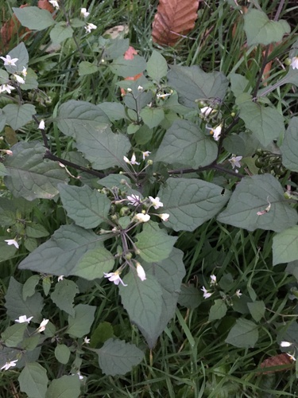

- ## iNat photos flashcards
  collapsed:: true
  [[iNat photos flashcards]]
	- {:height 200, :width 200}
	  [Observation](https://www.inaturalist.org/observations/142614865) by [[rhem42]] on 22/11/2022, 19:17 
	  [[Sandwingert]], [[Heidelberg]], [[Baden-Württemberg]], [[DE]] #card
	  collapsed:: true
		- {{embed [[Plantae/Tracheophyta/Angiospermae/Magnoliopsida/Solanales/Solanaceae/Solanoideae/Solaneae/Solanum/Solanum nigrum/Solanum nigrum]]}}
	- {:height 200, :width 200}
	  [Observation](https://www.inaturalist.org/observations/142603913) by [[rhem42]] on 22/11/2022, 16:04 
	  [[Naturpark Neckartal-Odenwald e.V.]], [[Dossenheim]], [[Baden-Württemberg]], [[DE]] #card
	  collapsed:: true
		- {{embed [[Plantae/Tracheophyta/Angiospermae/Magnoliopsida/Rosales/Rosaceae/Amygdaloideae/Amygdaleae/Prunus/Prunus laurocerasus]]}}
	- {:height 200, :width 200}
	  [Observation](https://www.inaturalist.org/observations/142603846) by [[rhem42]] on 22/11/2022, 16:02 
	  [[Naturpark Neckartal-Odenwald e.V.]], [[Dossenheim]], [[Baden-Württemberg]], [[DE]] #card
	  collapsed:: true
		- {{embed [[Plantae/Tracheophyta/Angiospermae/Magnoliopsida/Lamiales/Scrophulariaceae/Buddlejeae/Buddleja/Buddleja davidii]]}}
	- {:height 200, :width 200}
	  [Observation](https://www.inaturalist.org/observations/142603824) by [[rhem42]] on 22/11/2022, 16:02 
	  [[Naturpark Neckartal-Odenwald e.V.]], [[Dossenheim]], [[Baden-Württemberg]], [[DE]] #card
	  collapsed:: true
		- {{embed [[Plantae/Tracheophyta/Angiospermae/Magnoliopsida/Lamiales/Scrophulariaceae/Buddlejeae/Buddleja/Buddleja davidii]]}}
	- {:height 200, :width 200}
	  [Observation](https://www.inaturalist.org/observations/142603794) by [[rhem42]] on 22/11/2022, 16:01 
	  [[Naturpark Neckartal-Odenwald e.V.]], [[Dossenheim]], [[Baden-Württemberg]], [[DE]] #card
	  collapsed:: true
		- {{embed [[Plantae/Tracheophyta/Angiospermae/Magnoliopsida/Lamiales/Oleaceae/Ligustrum/Ligustrum vulgare]]}}
	- {:height 200, :width 200}
	  [Observation](https://www.inaturalist.org/observations/142603737) by [[rhem42]] on 22/11/2022, 16:00 
	  [[L 598]], [[Walldorf]], [[Baden-Württemberg]], [[DE]] #card
	  collapsed:: true
		- {{embed [[Plantae/Tracheophyta/Angiospermae/Magnoliopsida/Fagales/Fagaceae/Quercus/Quercus/Quercus/Quercus petraea]]}}
	- {:height 200, :width 200}
	  [Observation](https://www.inaturalist.org/observations/142525606) by [[rhem42]] on 21/11/2022, 12:39 
	  [[Bergstraße - Mitte]], [[Heidelberg]], [[Baden-Württemberg]], [[DE]] #card
	  collapsed:: true
		- {{embed [[Animalia/Arthropoda/Myriapoda/Chilopoda/Geophilomorpha/Himantariidae/Haplophilus/Haplophilus subterraneus]]}}
	- {:height 200, :width 200}
	  [Observation](https://www.inaturalist.org/observations/142525256) by [[rhem42]] on 21/11/2022, 12:30 
	  [[Neckar]], [[Heidelberg]], [[Baden-Württemberg]], [[DE]] #card
	  collapsed:: true
		- {{embed [[Animalia/Arthropoda/Hexapoda/Insecta/Pterygota/Orthoptera/Ensifera/Tettigoniidea/Tettigonioidea/Tettigoniidae/Phaneropterinae/Phaneropterini/Phaneroptera/Phaneroptera/Phaneroptera nana]]}}
- ## iNat sounds flashcards
  [[iNat sounds flashcards]]
	- {:height 200, :width 200}
	  [Observation](https://www.inaturalist.org/observations/142540501) by [[ettodineve]] on 21/11/2022, 17:59 
	  [[38069 Nago-Torbole TN]], [[Italia]] #card
	  collapsed:: true
		- {{embed [[Animalia/Chordata/Vertebrata/Aves/Passeriformes/Scotocercidae/Cettia/Cettia cetti]]}}
	- {:height 200, :width 200}
	  [Observation](https://www.inaturalist.org/observations/140384111) by [[margung]] on 29/10/2022, 16:58 
	  [[39040 Laurein]], [[Autonome Provinz Bozen - Südtirol]], [[Italien]] #card
	  collapsed:: true
		- {{embed [[Animalia/Chordata/Vertebrata/Aves/Passeriformes/Muscicapidae/Erithacus/Erithacus rubecula]]}}
	- {:height 200, :width 200}
	  [Observation](https://www.inaturalist.org/observations/138931219) by [[tizianaciaghi]] on 16/10/2022, 06:20 
	  [[38068 Rovereto TN]], [[Italia]] #card
	  collapsed:: true
		- {{embed [[Animalia/Chordata/Vertebrata/Aves/Passeriformes/Muscicapidae/Erithacus/Erithacus rubecula]]}}
	- {:height 200, :width 200}
	  [Observation](https://www.inaturalist.org/observations/138648409) by [[rosalia_trento]] on 13/10/2022, 22:31 
	  [[Dos Trento Apuleio]], [[38122 Trento TN]], [[Italia]] #card
	  collapsed:: true
		- {{embed [[Animalia/Chordata/Vertebrata/Aves/Strigiformes/Strigidae/Bubo/Bubo bubo]]}}
	- {:height 200, :width 200}
	  [Observation](https://www.inaturalist.org/observations/138593094) by [[desversen]] on 13/10/2022, 11:11 
	  [[Trento]], [[Trentino-Alto Adige]], [[IT]] #card
	  collapsed:: true
		- {{embed [[Animalia/Chordata/Vertebrata/Aves/Piciformes/Picidae/Dryocopus/Dryocopus martius]]}}
	- {:height 200, :width 200}
	  [Observation](https://www.inaturalist.org/observations/136018958) by [[desversen]] on 22/09/2022, 12:03 
	  [[Trento]], [[Trentino-Alto Adige]], [[IT]] #card
	  collapsed:: true
		- {{embed [[Animalia/Chordata/Vertebrata/Aves/Piciformes/Picidae/Dryocopus/Dryocopus martius]]}}
	- {:height 200, :width 200}
	  [Observation](https://www.inaturalist.org/observations/135214909) by [[aaroniemma]] on 16/09/2022, 07:27 
	  [[Valt]], [[38042 Valt TN]], [[Italia]] #card
	  collapsed:: true
		- {{embed [[Animalia/Chordata/Vertebrata/Aves/Passeriformes/Muscicapidae/Phoenicurus/Phoenicurus ochruros]]}}
	- {:height 200, :width 200}
	  [Observation](https://www.inaturalist.org/observations/135142532) by [[flori_m]] on 15/09/2022, 19:35 
	  [[Ritten]], [[Südtirol]], [[IT]] #card
	  collapsed:: true
		- {{embed [[Animalia/Chordata/Vertebrata/Aves/Strigiformes/Strigidae/Bubo/Bubo bubo]]}}
	- {:height 200, :width 200}
	  [Observation](https://www.inaturalist.org/observations/135024738) by [[toutterrain]] on 14/09/2022, 21:13 
	  [[Sant'Orsola Terme]], [[Südtirol]], [[IT]] #card
	  collapsed:: true
		- {{embed [[Animalia/Chordata/Vertebrata/Mammalia/Theria/Placentalia/Euarchontoglires/Rodentia/Sciuromorpha/Gliridae/Glirinae/Glis/Glis glis]]}}
	- {:height 200, :width 200}
	  [Observation](https://www.inaturalist.org/observations/135024465) by [[toutterrain]] on 14/09/2022, 21:11 
	  [[Sant'Orsola Terme]], [[Südtirol]], [[IT]] #card
	  collapsed:: true
		- {{embed [[Animalia/Chordata/Vertebrata/Mammalia/Theria/Placentalia/Euarchontoglires/Rodentia/Sciuromorpha/Gliridae/Glirinae/Glis/Glis glis]]}}