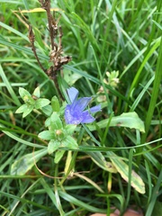

- 
	- [[to-latin]] #card
		- [[Cichorium intybus](https://www.inaturalist.org/observations/140773309)](https://www.inaturalist.org/taxa/52913-Cichorium-intybus)
	- [[Plant Family]] #card
		- Subfamily Cichorioideae (*Chicories, Dandelions, and Allies*)